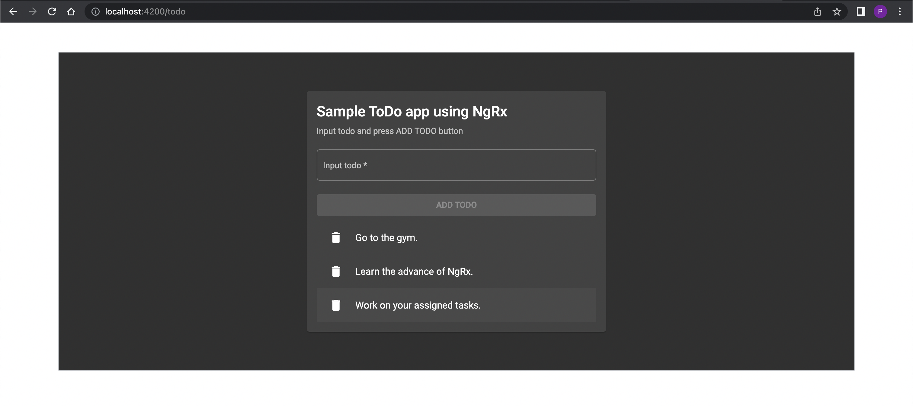

# What is this?

This is a sample demo todo app using `NgRx` lib (and its other dependencies) as a scalable approach to handle the state management in Angular. This follows the tutorial [I bet you can understand NgRx after watching this video](https://www.youtube.com/watch?v=kx0VTgTtSBg).

**NOTE:** This app is refactored using `NgRx` lib to handle the state management instead of `BehaviorSubject` approach. For the app that uses `BehaviorSubject` approach, please check out [Why you *should* use NgRx if you're learning Angular](https://www.youtube.com/watch?v=B3KJvoyQUdE), and [its source code](https://bitbucket.org/mipela-product-team/sample-todo-app-using-subject/src/master/).

# How to make this app up and running?

Clone this app with git command. -> Then open the app's root and run `npm install` to install the npm packages. -> Then run `npm run start` or `ng serve` to trigger the app. -> Then open your browser to with address `localhost:4200`.

